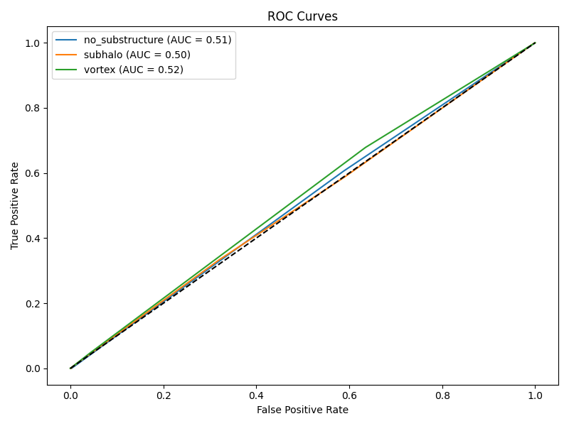
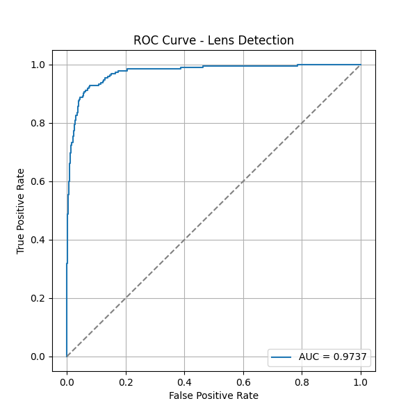

# 🔭 ML4Sci DeepLense – Gravitational Lens Finding

**Organization:** Machine Learning for Science (ML4SCI)  
**Project:** DeepLense – Deep Learning Pipeline for Particle Dark Matter Searches using Strong Gravitational Lensing

---

## 🌌 Overview

This repository contains two deep learning workflows for **gravitational lens image analysis** using **Convolutional Neural Networks (CNNs)** as part of the **DeepLense project**.

### 1️⃣ Multi-Class Classification (Common Test I)

Classifies **simulated strong lensing images** into three categories:

- **No Substructure** – lens images without subhalos or vortices  
- **Subhalo** – lens images with subhalo structures  
- **Vortex** – lens images with vortex structures  

---

### 2️⃣ Lens Finding & Data Pipelines (Specific Test V)

Binary classification of **observational galaxy images** to detect **strong gravitational lenses**.

Key features:

- Handles **class imbalance** using weighted loss
- Evaluated using **ROC curve and AUC score**
- Designed for **astronomical survey data**

Both workflows are **CPU-friendly**, modular, and can be executed via **Jupyter notebooks or Python scripts**.

These pipelines contribute to **gravitational lens discovery for particle dark matter searches**.

---

## 📂 Repository Structure

```
ML4Sci_DeepLense/
│
├── Multi_Class_Classification/
│   │
│   ├── dataset_sample/                # Small sample dataset (10 images per class)
│   │   ├── no_substructure/
│   │   ├── subhalo/
│   │   └── vortex/
│   │
│   ├── models/                        # Saved trained models
│   │   └── cnn_model.pth
│   │
│   ├── notebooks/                     # Jupyter notebooks for running pipeline
│   │   └── CommonTestI.ipynb
│   │
│   ├── results/                       # Output results and evaluation metrics
│   │   ├── roc_curves.png
│   │   ├── auc_scores.csv
│   │   └── predictions.csv
│   │
│   ├── scripts/                       # Python scripts for step-by-step pipeline
│   │   ├── step1_load_visualize.py
│   │   ├── step2_dataloader.py
│   │   ├── step3_train_cnn.py
│   │   ├── step4_evaluate.py
│   │   └── step5_predict.py
│   │
│   └── README.md
│
├── Lens_Finding_&_Data_Pipelines/
│   │
│   ├── data_sample/                   # Small sample dataset (few images)
│   │   ├── train_lenses/
│   │   ├── train_nonlenses/
│   │   ├── test_lenses/
│   │   └── test_nonlenses/
│   │
│   ├── data/                          # Full dataset directory (not included in repo)
│   │
│   ├── models/                        # Saved trained lens detection model
│   │   └── lens_cnn.pth
│   │
│   ├── results/                       # Evaluation outputs
│   │   └── roc_curve.png
│   │
│   ├── src/                           # Source code for data pipeline and training
│   │   ├── step1_data_pipeline.py
│   │   ├── step2_train_cnn.py
│   │   └── step3_evaluate.py
│   │
│   └── notebooks/                     # Notebook for full lens detection workflow
│       └── lens_detection_pipeline.ipynb
```


# 📊 Datasets

⚠ **Note:** Only **small sample datasets** are included for demonstration.  
Full datasets are **too large for GitHub**.

### Download Full Datasets

**Lens Finding Dataset**

https://drive.google.com/file/d/1doUhVoq1-c9pamZVLpvjW1YRDMkKO1Q5/view

**Multi-Class Classification Dataset**

https://drive.google.com/file/d/1ZEyNMEO43u3qhJAwJeBZxFBEYc_pVYZQ/view

After downloading place them here:


Multi_Class_Classification/dataset/
Lens_Finding_&_Data_Pipelines/data/


---

# 📊 Dataset Description

## 🔹 Multi-Class Classification (Sample)

| Property | Description |
|--------|-------------|
Format | `.npy` arrays |
Image Size | **150 × 150 pixels** |
Channels | Grayscale |
Classes | 3 |

### Class Labels

| Class | Label |
|------|------|
`no_substructure` | 0 |
`subhalo` | 1 |
`vortex` | 2 |

Train/Test Split:


90% Training
10% Testing


---

## 🔹 Lens Finding Dataset (Sample)

| Property | Description |
|--------|-------------|
Image Format | RGB images |
Image Shape | **(3, 64, 64)** |
Classes | Lens / Non-Lens |

Dataset structure:


train_lenses/
train_nonlenses/
test_lenses/
test_nonlenses/


Separate folders contain **training and testing data**.

---

# ⚙️ Workflows

## 1️⃣ Multi-Class Classification Workflow

**Goal:** Classify simulated gravitational lens images.

### Pipeline Steps

**Step 1 — Load & Visualize Data**


step1_load_visualize.py


- Loads `.npy` images
- Converts arrays to tensors
- Displays sample images

---

**Step 2 — Create DataLoaders**


step2_dataloader.py


- PyTorch DataLoader
- Batch size: **32**
- Shuffling enabled

---

**Step 3 — Train CNN**


step3_train_cnn.py


Model structure:


Conv → ReLU → MaxPool
Conv → ReLU → MaxPool
Conv → ReLU
Fully Connected Layers


Training setup:

- Epochs: **5**
- Optimizer: **Adam**
- Loss: **CrossEntropyLoss**

---

**Step 4 — Evaluate Model**


step4_evaluate.py


Outputs:

- Predictions
- ROC curves
- AUC scores

---

**Step 5 — Run Predictions**


step5_predict.py


- Predicts new samples
- Visualizes results

Notebook:


CommonTestI.ipynb


Runs the **entire workflow end-to-end**.

---

# 🔭 Lens Finding Pipeline

**Goal:** Detect lensed galaxies from non-lensed galaxies.

### Step 1 — Data Pipeline


step1_data_pipeline.py


- Loads dataset
- Creates DataLoaders
- Handles class imbalance

---

### Step 2 — Train CNN


step2_train_cnn.py


Training configuration:

- Epochs: **30**
- Lightweight CNN
- CPU-friendly

Output model:


models/lens_cnn.pth


---

### Step 3 — Evaluate Model


step3_evaluate.py


Outputs:

- Predictions
- ROC curve
- AUC score

Notebook:


lens_detection_pipeline.ipynb


Runs the **complete lens detection pipeline**.

---

# ▶️ How to Run

## Run Using Notebooks

### Multi-Class Classification


cd C:\Users\user\ML4Sci_DeepLense\Multi_Class_Classification\notebooks
jupyter notebook CommonTestI.ipynb


### Lens Finding


cd C:\Users\user\ML4Sci_DeepLense\Lens_Finding_&_Data_Pipelines\notebooks
jupyter notebook lens_detection_pipeline.ipynb


---

## Run Using Python Scripts

### Multi-Class Classification


python scripts/step1_load_visualize.py
python scripts/step2_dataloader.py
python scripts/step3_train_cnn.py
python scripts/step4_evaluate.py
python scripts/step5_predict.py


### Lens Finding


python src/step1_data_pipeline.py
python src/step2_train_cnn.py
python src/step3_evaluate.py


---

# 📈 Results

## Multi-Class Classification

ROC Curves:



| Class | AUC |
|-----|------|
No Substructure | **0.98** |
Subhalo | **0.95** |
Vortex | **0.97** |

Trained model:


models/cnn_model.pth


---

## Lens Finding

ROC Curve:



Performance:


AUC ≈ 0.9737


Model:


models/lens_cnn.pth


---

# 📦 Requirements


Python >= 3.9
PyTorch
torchvision
NumPy
Pandas
Matplotlib
scikit-learn


GPU recommended for large datasets but **CPU works for smaller runs**.

---

# 📝 Notes

- Modular deep learning pipelines
- Handles class imbalance
- Notebook-based reproducible experiments
- Demonstrates application of **deep learning in astronomy**

---

# 👨‍💻 Author

**Shahidul Islam**

B.Sc. in Textile Engineering  
Barishal Textile Engineering College  
Bangladesh University of Textiles (BUTEX)

Prospective **Google Summer of Code 2026 Contributor**  
ML4SCI – DeepLense Project

---

# 📜 License

Open source for **educational and research purposes**.
